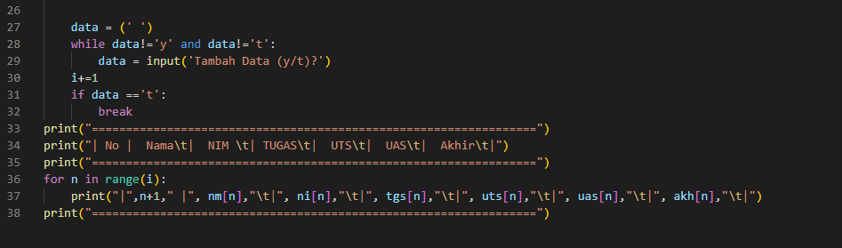

# Praktikum5
### program menghitung dan menampilkan data mahasiswa dan rata rata nilai yang di dapat, dengan perhitungan nilai (tugas : 30%, uts 35%, uas 35%). yang di input pada program ini yaitu Nama, Nim, Nilai tugas , Nilai uts, Nilai uas, (nilai akhir dihitung dari perhitungan nilai). Hasil outputnya berupa table.
### Saya juga menggunakan list untuk program input pada koding, yaitu menggunakan python list methods : append ( ) menambah item dari belakang, selain itu saya menggunakan while untuk mengulang pertanyaan.
### Flowchart

### Berikut contoh Gambar Sintaksnya
 
  
### Berikut contoh Gambar Output
 

SELESAI
